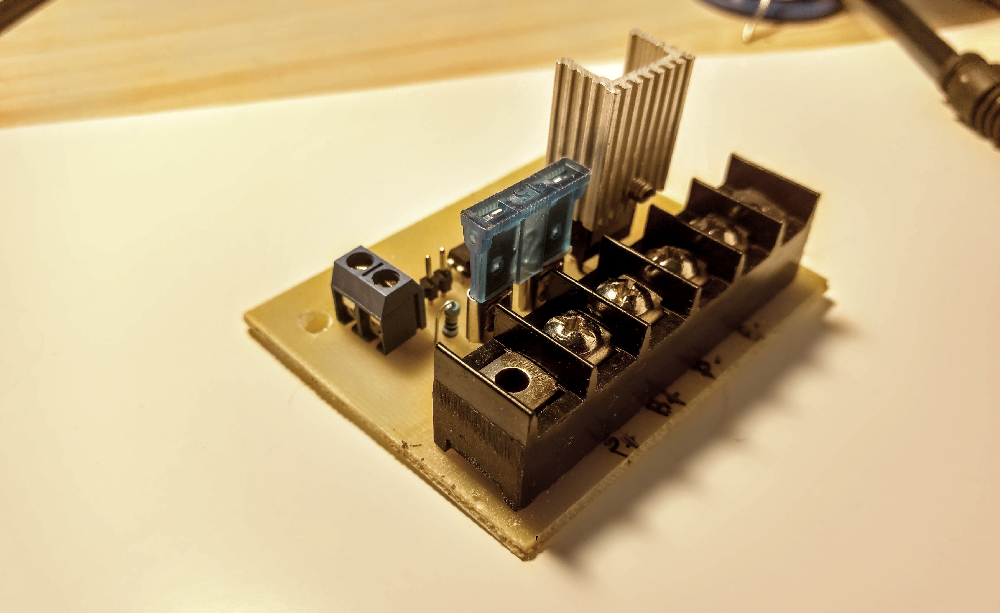

# DC LOAD CONTROL, aka "External Mosfet"

DC charge controller, originally created to control heated 3D printer desks.

Based on https://github.com/Digital-Sqrt/Little-Driver

You can connect this controller to any digital signal up to 12v. If the signal is less than 5.5 you need to close Jumper JP1.

You can connect the heated desktop output from RAMPS (or any other 3D printer card directly to the SIGNAL input)
